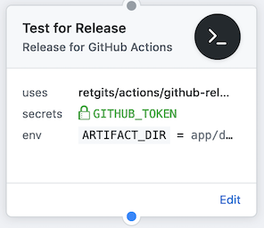

# Release action



## Details

| Item              | Description                                                                                   |
|-------------------|-----------------------------------------------------------------------------------------------|
| Purpose           | Create a release on GitHub, using [ghr](https://github.com/tcnksm/ghr)                        |
| Usage             | Upload artifacts in the `ARTIFACT_DIR` folder and sets the `VERSION` based on the current tag |
| Base container    | [alpine:3.9](https://hub.docker.com/_/alpine?tab=description)                                 |
| Language runtimes | none                                                                                          |
| Additional tools  | git, curl, wget, jq                                                                           |

## Usage

The action can be used in a workflow to create a new release on GitHub in the repository where the workflow runs. If the `ARTIFACT_DIR` is not provided, the script will set it to `dist/`. The name of the new version will be the tag that triggered this release. If no valid tag is found, a version will be created using the current date/time.

```hcl
action "Release" {
  uses = "retgits/actions/github-release@master"
  secrets = ["GITHUB_TOKEN"]
  env = {
    ARTIFACT_DIR = "app/dist/"
  }
}
```