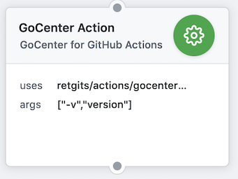

# GoCenter action



## Details

| Item              | Description                                                                                                       |
|-------------------|-------------------------------------------------------------------------------------------------------------------|
| Purpose           | A wrapper around the [goc](https://github.com/jfrog/goc) to use with [GoCenter](https://gocenter.jfrog.com/stats) |
| Usage             | Build Go apps using modules resolved from [GoCenter](https://gocenter.jfrog.com/stats)                            |
| Base container    | [golang:alpine](https://hub.docker.com/_/golang?tab=description)                                                  |
| Language runtimes | [Go 1.12.1](https://golang.org/doc/go1.12)                                                                        |
| Additional tools  | git, curl, wget                                                                                                   |

## Usage

The action can be used in a workflow to execute any **Go** action. The actions must be supplied as an array to the `args` parameter and each individual action will be executed via `sh -c` and prefixed with `goc` (instead of `go build`, the args would be just `build`).

```hcl
action "GoCenter for GitHub Actions" {
  uses = "retgits/actions/goc@master"
  args = ["ls -ltr"]
}
```