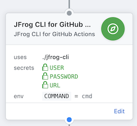

# JFrog CLI (Go) action



## Details

| Item              | Description                                                                  |
|-------------------|------------------------------------------------------------------------------|
| Purpose           | A wrapper around the [JFrog CLI](https://jfrog.com/getcli/)                  |
| Usage             | Executes commands against [JFrog Artifactory](https://jfrog.com/artifactory) |
| Limitations       | Only supports JFrog Artifactory, not any of the other JFrog products         |
| Base container    | [golang:alpine](https://hub.docker.com/_/golang?tab=description)             |
| Language runtimes | [Go 1.12.6](https://golang.org/doc/go1.12)                                   |
| Additional tools  | git, curl, wget                                                              |

## Usage

The action can be used in a workflow to execute actions against JFrog Artifactory. The actions must be supplied as the `args` parameter and will be prefixed with `jfrog rt` by the [script](./entrypoint.sh). This action supports three mechanisms to authenticate to Artifactory and based on which type you choose the variable `CRED` (which determines the credential type) has to be set as well.

| Authentication type | Variables to set  | Set `CRED` to |
|---------------------|-------------------|---------------|
| Login Credentials   | USER and PASSWORD | username      |
| API Key             | APIKEY            | apikey        |
| Access Token        | ACCESSTOKEN       | accesstoken   |

As you're setting these, _please make sure you set them as "secrets"_

There are two other environment variables that are required

| Variable | Description                                                                      |
|----------|----------------------------------------------------------------------------------|
| `URL`    | The Artifactory URL                                                              |
| `args`   | The command to execute, but without `jfrog rt` (like `build-publish my-build 1`) |

```hcl
action "JFrog CLI for GitHub Actions" {
  uses = "retgits/actions/jfrog-cli-go@master"
  secrets = ["USER", "PASSWORD", "URL"]
  args = ["cmd"]
  env = {
    CRED = "username"
  }
}
```
