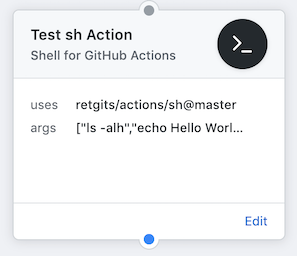

# sh action



## Details

| Item              | Description                                                     |
|-------------------|-----------------------------------------------------------------|
| Purpose           | A multi-purpose [Alpine](https://alpinelinux.org) image         |
| Usage             | Executes each command listed in the Action's `args` via `sh -c` |
| Base container    | [alpine:3.9](https://hub.docker.com/_/alpine?tab=description)   |
| Language runtimes | none                                                            |
| Additional tools  | git, curl, wget, jq                                             |

## Usage

The action can be used in a workflow to execute any arbitrary action. The actions must be supplied as an array to the `args` parameter and each individual action will be executed via `sh -c`.

```hcl
action "Shell" {
  uses = "retgits/actions/sh@master"
  args = ["ls -ltr"]
}
```